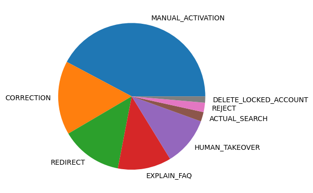
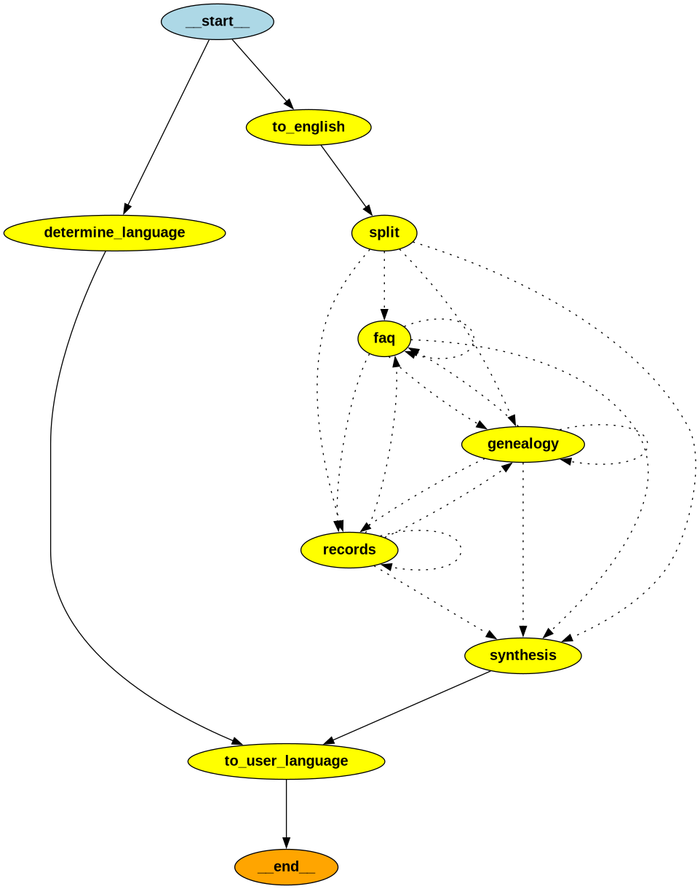
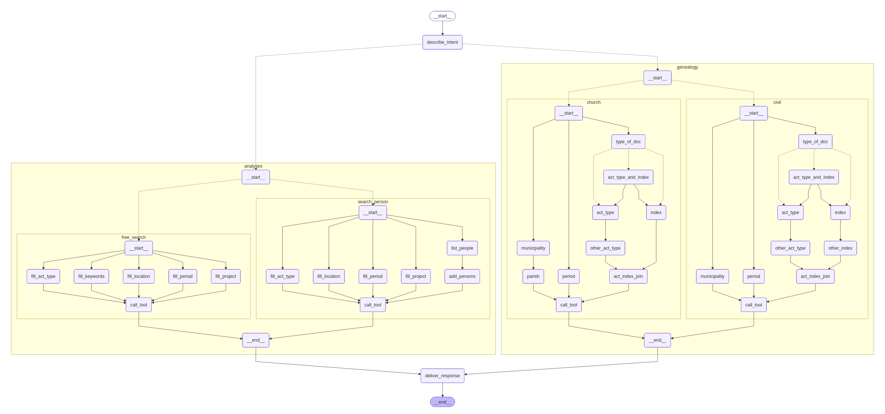
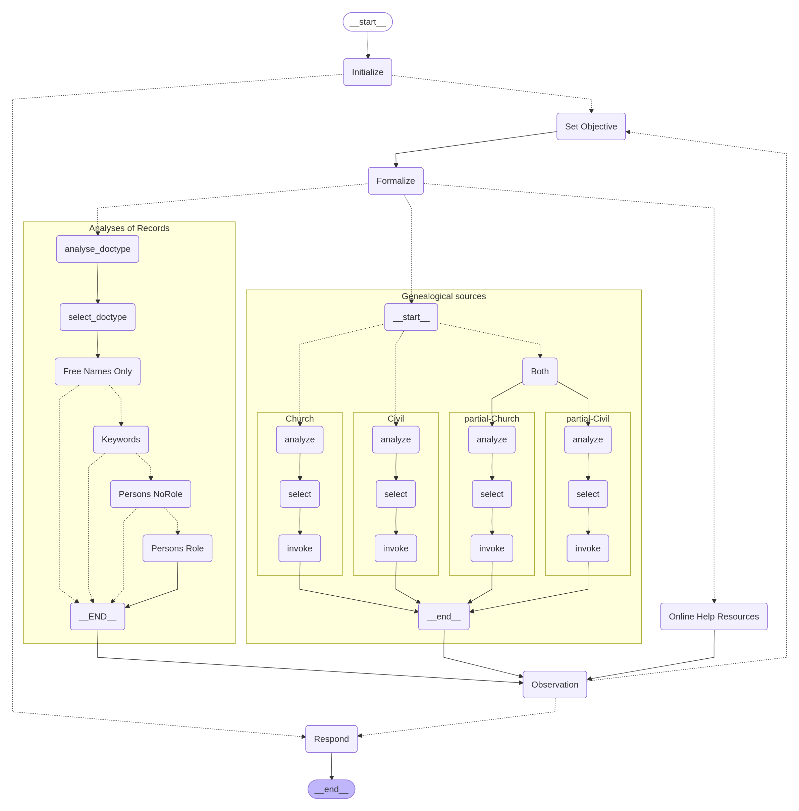

# Ask Agatha

Le point de départ de ce projet, c'est que les personnes (essentiellement
Annelies et Raphaelle) qui gèrent la mailbox digit des AGR font face à une
grosse charge de travail pour la gestion de cette mailbox ... qui contient
beaucoup de questions assez similaires les unes aux autres. L'idée initiale
était donc de développer un truc qui permette de leur alléger le travail. Au
fil du temps, l'outil a évolué pour devenir un rag agentique qui interagit avec
[AGATHA](https://agatha.arch.be/).

L'objectif premier était donc d'être capable de lire les emails dans la mailbox
puis renvoyer une réponse via SMTP. Ce qui avait le double avantage de: 

1. ne pas changer les habitudes des utilisateurs: ils continuent à envoyer un
   mail à la même adresse et recoivent une réponse avec un certain délai.

2. donner plus de temps à l'outil pour générer sa réponse puisque les archives
   ne sont pas dotées de GPU pour réaliser l'inférence et que, étant donné le
   caractère très sensible des données (par ex: "je veux les infos a propos 
   de mon grand père collabo") et les finances des archives, on ne peut pas 
   permis d'utiliser des services cloud.

Au commencement, je suis donc parti d'un dump de la mailbox digit. Le dump qui
m'a été fourni contient beaucoup plus d'info que ce qui est nécessaire. En effet,
le corpus de mail qui nous intéresse ne comprend que les emails qui ont été
**envoyés depuis la mailbox digit**. Le reste ne nous intéresse pas, puisque ce
qu'on cherche, c'est à faire un outil qui donne plus ou moins les mêmes réponses
qu'Annelies et Raphaelle. Tous les mails qui ne sont pas des _réponses_ n'ont
donc aucun intérêt dans ce contexte-ci. 

Par ailleurs, dans l'archive qui m'a été donnée, tous les mails sont fournis 
dans deux formats différents:

* **.eml** un format propriétaire de Microsoft 
* **.txt** un dump en texte brut

#### Code

Tout le code de ce dont je vais parler ci dessous est disponible sur le 
repository github [xgillard/agr_agent](https://github.com/xgillard/agr_agent).

Avant d'entamer le développement de ask-agatha dont le code est dans le
repository que je viens de mentionner
[xgillard/agr_agent](https://github.com/xgillard/agr_agent), j'ai aussi fait
une série d'expérimentations pendant lesquelles j'ai cherché à développer un
premier rag qui permette de répondre à ces questions. Le code de ces premières
expérimentations est disponible sur le repository
[xgillard/ragagr](https://github.com/xgillard/ragagr).

## Chargement des emails

Ma première idée a consisté à chercher un `DocumentLoader` qui soit capable de
parser les conversations encodées dans les fichiers `*.eml` afin de pouvoir
récupérer des conversations structurées et auxquelles je pourrais appliquer un
chat template si je veux. La solution à ce problème a donc été d'utiliser
`UnstructuredEmailLoader` qui fournit un binding entre `langchain` et
`unstructured` pour parser le contenu de fichiers `*.eml`. 

Si le parsing fonctionne, il y a toutefois **deux problèmes** auxquels j'ai été
confronté: 

1. le parsing lance parfois des exceptions à cause de l'encodage un peu 
    exotique de certains mails.
2. le parsing des emails donne des objets qui sont structurés, mais le contenu
    de la conversation reste, lui, parfaitement déstructuré.

J'ai donc changé mon fusil d'épaule et j'ai commencé à travailler avec les 
fichiers `*.txt` qui sont -- je trouve, plus facile à manipuler.

## Exploration des données

Pour me faire une idée de la teneur des données avec lesquelles j'allais 
travailler, j'ai moi-même lu environ 300 emails et je les ai classés dans
différentes catégories (à la main, en utilisant une instance locale de 
labelbox). 

Ce qui est ressorti de cette analyse exploratoire, c'est que le dataset est
très fortement déséquilibré. Comme on peut le voir dans le graphe ci-dessous,
les questions liées à l'activation des comptes représentent une fraction
disproportionnée des requêtes. En 2e lieu arrivent les demandes de correction
dans les données des archives, puis les autres types de requêtes (par exemple:
rediriger l'utilisateur vers un dépôt en particulier, ou mener effectivement
une recherche pour le compte de l'utilisateur).

## Embedding des emails

> [!WARNING]
> Cette approche n'est pas la bonne ! Je l'explique pour que tu ne penses pas 
> à refaire la même erreur que moi. Le code correspondant à tout ça se trouve
> sur le repo [xgillard/ragagr](https://github.com/xgillard/ragagr).

Une fois les emails chargés, ma première intuition a été de chercher à calculer
des embeddings pour les emails, les stocker dans la DB, 
afin de faire une recherche sémantique qui aurait pu permettre de retrouver la
ou les réponses pertinentes avant de générer une réponse pour l'utilisateur.

## Alternative: utilisation des guides et FAQ plutot que des mails

Comme [AGATHA](https://agatha.arch.be) est assez bien documenté, il y a un 
certain nombre d'informations qui peuvent être utilisées pour donner une 
information utile à un utilisateur, même sans exploiter le corps des emails.
Ces informations viennent de quatre sources distinctes:

1. [Genealogie: par ou commencer ?](https://agatha.arch.be/help/beginning/)
2. [Manuel utilisateur des sources généalogiques](https://agatha.arch.be/help/beginning/)
3. [Manuel utilisateur des analyses d'actes](https://agatha.arch.be/help/Archives-de-l-Etat_manuel-utilisation-analyses-actes.pdf)
4. [Les FAQ de AGATHA](https://agatha.arch.be/help/)

### Chunking

Comme il est nécessaire de faire un chunking des documents avant de pouvoir
calculer leur embedding, et les stocker dans une DB vectorielle en vue de faire
une recherche sémantique, j'ai procédé en adoptant une approche qui depend du
type de source considérée (les FAQ ne devraient pas être traitées de la même
façon que les manuels utilisateur). Mais pour les longs documents, j'ai utilisé
la même approche que ce qui fonctionnait bien pour le prototype 
[rag fial](./rag_fial.md). A savoir: utiliser un chunking récursif tel 
que c'est implémenté par `RecursiveCharacterTextSplitter`.

### Structure du workflow

Afin d'augmenter l'efficacité de la recherche, j'ai décidé de grouper les
informations de ces différentes sources en fonction du contenu dont elles parlent
puis de faire la recherche dans la bonne db en fonction du contexte. Après chaque
recherche, il devait être possible de compléter les informations en allant
chercher des informations supplémentaires dans l'une ou l'autre source jusqu'à
atteindre la saturation et la génération d'une réponse.

Le design du systeme est donc le suivant:

### Workflow alternatif avec CrewAi

A titre d'expérience, j'ai fait un prototype travaillant sur les mêmes
informations et avec [crewai](https://www.crewai.com/). Le système était très
facile à développer (on déclare un certain nombre d'agents indépendants qui ont
chacun un role propre et qui se coordonnent pour remplir la requete de
l'utilisateur). **Mais malheureusement, la librairie est très solidement axée
vers l'utilisation dun LLM hébergé dans le cloud. Ce qui n'est pas compatible
avec les données sensibles qui sont manipulées**.

## Modèle agentique

Fort de mon expérience avec la bibliothèque de crewai, j'ai voulu expérimenter
un modèle qui soit plus agentique (sans être vraiment une _crew_ d'agents
multiples). J'ai aussi voulu faire en sorte que le système soit capable de
mener de vraies recherches, en exploitant les données qui sont effectivement
disponibles dans les collections des archives (comprendre les collections
numérisées et rendues publiquement disponibles au travers de AGATHA).

### Le code

Tout le code pour ce nouveau workflow est disponible sur le repository
[xgillard/agr_agent](https://github.com/xgillard/agr_agent/). Dans ce repo, 
on trouve toute une série de fichiers à la racine. Ceux-ci ne sont pas vraiment
intéressants, ils sont surtout un side-effect (indésirable mais néanmoins utile)
de la labelisation manuelle que j'ai réalisé pour classifier les emails.
On y trouve aussi:

* [le fichier arkey_demo.py](https://github.com/xgillard/agr_agent/blob/main/arkey_demo.py)
  qui implémente une interface utilisateur simple pour interagir avec l'agent.
  Cette interface utilisateur est réalisée avec streamlit.

* [le dossier corpus](https://github.com/xgillard/agr_agent/tree/main/corpus)
  qui, comme son nom ne l'indique pas vraiment, contient une série de notebooks
  que j'ai utilisé pour faire de l'augmentation de données en vue de
  ré-équilibrer le dataset (utile si on veut entrainer un classifier pour choisir
  le bon outil à utiliser).

* [le package agents](https://github.com/xgillard/agr_agent/tree/main/agents) 
  qui est un package python contenant tout le code nécessaire à l'interaction
  avec agatha et avec le llm. **C'EST ICI QUE SE TROUVE LE COEUR INTERESSANT
  DU SYSTEME**.

#### Structure du package 'agents'

Dans ce package, on trouve deux sous modules: 

* [agents.local_llm](https://github.com/xgillard/agr_agent/tree/main/agents/local_llm)
  qui implémente la logique des flux d'interactions avec les LLM (= les graphes
  et sous graphes implémentés avec langgraph). C'est donc ici qu'on organise
  l'information qui va être mémorisée dans le contexte. C'est ici aussi qu'on 
  orchestre l'exécution des différentes tâches d'interaction avec le (ou les)
  LLM et qu'on route la requête d'un sous-système à un autre.

* [agents.tools](https://github.com/xgillard/agr_agent/tree/main/agents/tools)
  qui implémente la logique nécessaire à l'utilisation d'un outil / moteur de
  recherche offert par la plateforme agatha.

#### Note à propos des outils

Il est important de noter que bien que le package s'appelle 'tools' et que 
fonctionnellement il offre le même service qu'une collection d'outils (`@tool`),
ce code ne fournit aucun "outil" directement géré et mis à la disposition du
LLM dans une boucle ReAct.

En effet, les outils offerts par Agatha sont trop complexes et offrent trop 
d'options différentes (mais qui doivent rester cohérentes entre elles si on
veut obtenir un résultat) afin de pouvoir être gérés directement par un `@tool`.
Les outils sont donc découpés en deux parties: la partie qui fait l'interaction
pure avec agatha (et dont on trouve l'implémentation dans `agents.tools`) et
la partie qui fait l'intégration de cet outil dans un système drivé par un LLM
utilisé comme moteur de raisonnement. Cette seconde partie est donc constituée
d'une série de graphes langgraph (dont on trouve le code dans `agents.local_llm`).

> [!NOTE] 
> Un élémnent qui est intéressant à savoir, c'est qu'une partie du code
> "modèle" pour les schémas liés aux objets qui viennent de agatha sont en fait
> auto générés à partir du site web de agatha lui meme.
> 
> En effet, le script `agents.tools.agatha2enum` est exécuté toutes les nuits
> (github action) et parse le code source des pages d'agatha afin de générer
> le code des énumérations nécessaires pour interagir avec la plateforme.

##### Topologies testées

Pendant mes expérimentations et la phase de développement, j'ai testé plusieurs
approches pour le développement des outils. Il y en a essentiellement deux que
j'ai trouvé intéressantes: 
1. L'approche "miroir" 
2. L'approche "cascade"

Mais dans les deux cas, on implémente une boucle
[ReAct](https://docs.langchain.com/oss/python/langchain/agents) ce qui permet
de découper la tâche à accomplir en plusieurs sous taches, d'enchainer
plusieurs étapes et non pas de se contenter d'une seule recherche dans une DB.

Par ailleurs, les deux versions du système sont toutes les deux complétées 
par la recherche "classique" dans une vector db afin de retrouver les passages
potentiellement intéressants dans les ressources d'aide en ligne (manuels
de l'utilisateur, FAQ)

###### Approche "miroir"

Cette approche est la plus simple et elle est décrite dans l'image ci-dessous.
On a un sous flux pour chaque moteur de recherche. Au sein de chacune ces flux,
on va avoir une étape pour récupérer chacun des paramètres qu'on peut passer au 
moteur de recherche lorsqu'on émet une requete. Toutes ces étapes sont exécutées
en parallèle, puis on envoie effectivement la requête vers agatha.

###### Approche "cascade"

L'approche cascade est assez simple à comprendre. Elle part de l'observation 
qu'il est beaucoup plus couteux de réaliser des étapes qui impliquent l'utilisation
d'un LLM que de faire une ou plusieurs requêtes vers le moteur de recherche de
agatha. Non seulement agatha permet de fonctionner en local (ok pour la privacy), 
et donc il ne nous charge pas le prix des tokens IN-OUT, mais en plus agatha 
répond incroyablement plus vite qu'un LLM. 

Pour cette raison, l'approche que j'ai nommée "approche cascade" essaie de limiter
les interactions llm avant de lancer une recherche sur agatha. On commence 
toujours par récupérer une valeur pour les paramètres qui sont absolument essentiels
puis on lance une recherche. En fonction du résultat obtenu on décide de 
récupérer une valeur pour des parametres supplémentaires (et donc raffiner la
recherche) ou de s'arrêter car on a trouvé des résultats qui sont déjà satisfaisants.

Un autre avantage de l'approche "cascade", c'est qu'elle encourage l'utilisation
un peu aggressive de plusieurs moteurs de recherches (par exemple les sources
d'état civil et les registres paroissiaux) avant qu'on n'ait eu besoin de trouver
la valeur exacte à passer à tous les paramètres. Cette approche évite aussi le
cas (trop fréquent !) où la récupération de tous les paramètres produit une requête
qui est **trop** précise et qui ne permet pas de retrouver le résultat escompté
parce qu'il ya  une petite erreur dans la requête .. ou dans les données.

