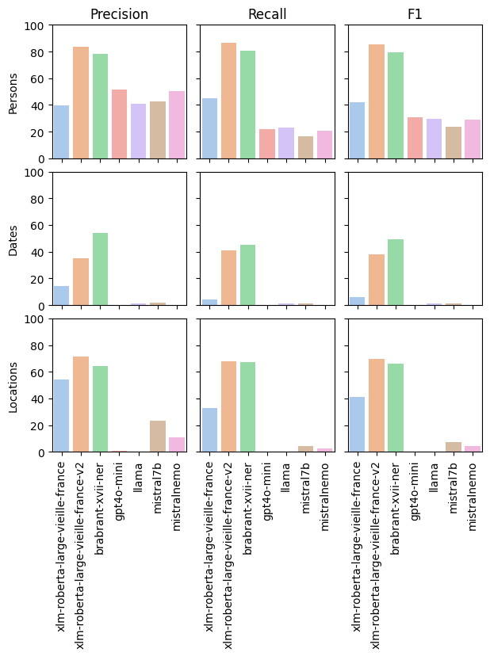
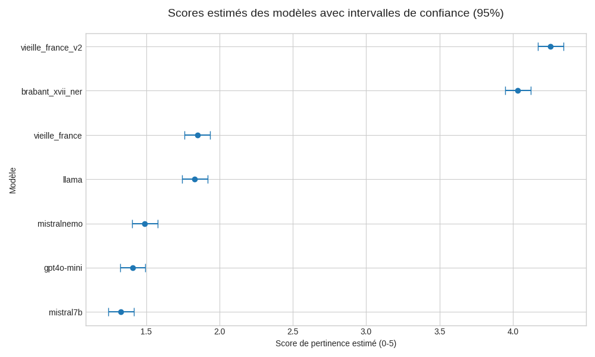

# Vade Mecum pour la reprise de Arkey

Bonjour à toi qui vient de prendre le relai sur le projet ARKEY.  Le but de 
ces quelques lignes n'est certainement pas de te dire quoi faire ou comment 
le faire. Mon but est simplement de te présenter ce qui a déjà été fait, ce
que j'avais en tête de faire avant mon départ et les ressources que j'ai 
trouvé utiles pour pouvoir avancer sur le projet. Bref, mon but est simplement
de te permettre de démarrer plus facilement et de pouvoir réutiliser mes 
travaux précédents si tu le souhaites.

## Resources Utiles
Avant de commencer à décrire ce qui a été fait, comment ça a été fait etc, 
je vais commencer par te donner une série de pointeurs vers des ressources et
outils que tu pourrais vouloir consulter (et que j'ai trouvé super utiles pour
ma part). Si tu consultes ce document plusieurs fois, j'imagine que c'est la
section que tu voudras trouver en 1er.

### Les ressources que j'ai trouvé utiles sont les suivantes:

* "Natural Language Processing" 
    ([spécialisation sur coursera](https://www.coursera.org/specializations/natural-language-processing))

* "Natural Language Processing with Transformers", 
    Lewis Tunstall, Leandro von Werra, and Thomas Wolf -- O'Reilly, 2022. 
    ISBN: 978-1-09813-679-6

* "Quantization Fundamentals with Hugging Face" 
    ([short course gratuit](https://learn.deeplearning.ai/courses/quantization-fundamentals?startTime=0) sur deeplearning.ai)

* "Quantization in Depth" 
    (encore un [short course gratuit](https://learn.deeplearning.ai/courses/quantization-in-depth?startTime=0) sur deeplearning.ai)

* "LLM Engineer's Handbook", 
    Paul Iusztin, and Maxime Labonne -- Packt, 2024. 
    ISBN: 978-1-83620-007-9

* "Learning Langchain",
    Mayo Oshin, and Nuno Campos -- O'Reilly, 2025. 
    ISBN: 978-1-83620-007-9

* ["Let's build ChatGPT: from scratch, in code, spelled out", Andrej Karpathyi](https://youtu.be/kCc8FmEb1nY?si=UX62dTXIQLsBQ4rr)

* [La documentation de sentence-transformers](https://sbert.net/)

* "Speech and Language Processing. (2nd ed)", 
    Dan Jurafsky, and James H. Martin -- Pearson, 2009. 
    ISBN: 978-0135041963. 
    
    Celui-ci reste une excellente référence même s'il commence à vieillir un 
    peu.


### Leaderboards & benchmarks

* [MMLU Leaderboard](https://www.kaggle.com/benchmarks/open-benchmarks/mmlu) 
    Pour comparer "à la grosse louche" la performance attendue de LLM génératifs

* [MTEB Leaderboard](https://huggingface.co/spaces/mteb/leaderboard)
    Pour comparer et choisir les modèles d'embedding à tester.

* [IFEval Leaderboard](https://huggingface.co/spaces/Krisseck/IFEval-Leaderboard)
    Pour comparer la performance de modèles en matière d'instruction following 
    (encore plus nécessaire comme on travaille avec de petits modèles)

* [Alpaca Eval](https://tatsu-lab.github.io/alpaca_eval/) 
    Idem (même si je l'ai moins utilisé).

* [GAIA Leaderboard](https://huggingface.co/spaces/gaia-benchmark/leaderboard). 
    Finalement je n'ai pas utilisé ce LB là car les tools fournis on top of 
    AGATHA sont trop complexes (même en branchant gemini-3-pro-preview). 
    Ma solution a donc consisté découper le travail en petites tâches et de
    les orchestrer avec langgraph.

**Et aussi _of course_**:
* La documentation de huggingface
* La documentation de langchain et langgraph
* La documentation de Ollama (très pratique pour prototyper)


### Moins directement lié
Parmi les ressources moins directement liées au NLP, mais que je re-consulte
régulièrement malgré tout: 

* "Hands-on Machine Learning with Scikit-Learn, Keras & Tensorflow (3rd ed)", 
    Aurélien Géron -- O'Reilly, 2025. 
    ISBN: 978-1-098-12597-4

* "Fluent Python (2nd ed)", 
    Luciano Ramalho -- O'Reilly, 2022. 
    ISBN: 978-1-492-05635-5

* "Analyse de données avec Python", 
    Wes McKinney -- O'Reilly, 2021. 
    ISBN: 978-2-41206-918-9

* "Deep Learning" ([spécialisation sur coursera](https://www.coursera.org/specializations/deep-learning))


## Outils qui m'ont été les plus utiles

* L'écosysteme huggingface: transformers, datasets, accelerate, peft,
    bitsandbytes
* unsloth pour le fine tuning de llm génératifs (adapters QLoRa & sauvegarde
    mergées en GGUF pour inférence locale)
* ONNX runtime: pour optimiser l'inférence de certains modèles. (Attention:
    c'est bien, mais parfois un peu fragile ou difficile à faire fonctionner).
* Ollama: Fait le serving de LLM quantisés. C'est **le plus simple à utiliser
    et je te conseille de continuer avec ça**.
* Langchain: pour abstraire les interactions LLM, intégrer des outils externes
    (eg. pour la collecte et chunking des données), pour le post-processing 
    avant ingest dans la vector DB
* Langgraph: pour concevoir, organiser et orchestrer des flux complexes
    d'interaction avec LLM
* Langsmith: pour observer les résultats, évaluer les prompts et diagnostiquer
    les erreurs
* Postgres + [PgVector](https://github.com/pgvector/pgvector): Vector Database
    assez robuste
* ChromaDB: Vector Database assez light. Parfaite pour prototyper en local
* Docker-Compose & Docker: pour éviter les dependency hell & faciliter le
    déploiement de systemes comprenant plusieurs sous-systtemes.
* [uv](https://github.com/astral-sh/uv): gestion de projet & dépendances
    efficace en python.
* React pour tout ce qui est développement frontend un peu avancé
* Streamlit pour offrir un prototype de frontend avec très peu d'efforts.
* Labelbox pour organiser la création de corpus taggués par des collaborateurs
    non-techniciens


## Ce qui a été fait

Pendant les 2 premières années de mon travail sur ARKEY, j'ai essentiellement
travaillé sur les sujets suivants: 

* Comparer les performances de modèles génératifs avec les performances de 
    modèles task-specific pour l'extraction d'entité nommées.
* Developper des plateformes RAG pour accéder aux archives de l'université
    (faculté FIAL) ou des archives de l'état (via AGATHA).

Ci-dessous, tu trouveras quelques explications sur les différentes étapes de
ce que j'ai réalisé et comment les choses ont été faites.


### Confection d'un corpus de textes anciens.

J'ai travaillé avec _Gert Gielis_ (qui a désormais quitté les archives) et
_Klaas Van Gelder_ pour collecter et nettoyer une série de 419 textes en
néérlandais et français moyen (XV-XVII). Les difficultés de ces textes tiennent
au fait que: 

* la casse (majuscule/minuscule) n'est pas significative
* la ponctuation est inexistante (et si elle est présente, on ne peut pas 
    lui attribuer de sens)
* la variété orthographique et lexicale est énorme (plusieurs orthographes 
    différentes pour le même mot).
* les langues sont mélangées (on passe du fr au nl dans le même texte).

**Si tu veux utiliser ce corpus, je l'ai rendu disponible sur huggingface**
[Lien direct vers le dataset](https://huggingface.co/datasets/xaviergillard/brabant-xvii-ner)


### AI-rchivist

Il s'agit d'une expérience que j'ai initialement développé pour pouvoir
comparer la performance des modèles génératifs avec la performance des modèles
de NLP plus classiques (BERT / RoBERTa) pour l'extraction d'entités nommées
(personnes, lieux, dates).

#### Interface Web

J'ai préparé une petite interface web
[ai-rchivist](https://github.com/xgillard/ai-rchivist) qui permette de demander
aux différents LLMs de réaliser l'extraction de données via du prompting.

J'ai fait plusieurs démonstrations, et les gens étaient à chaque fois
hyper enthousiastes. Les éléments qui me semblaient revenir le plus
souvent étaient ceux-ci:

* le système permet d'avoir très rapidement, des résumés du texte
  transcrit dans 4 langues (fr, nl, en, de). Si les résumés
  n'étaient pas parfaits (présence d'hallucinations), ca reste une
  feature qui est très appréciée et demandée.

* il est possible d'éditer tous les champs, partout dans
  l'interface web. Et le système est présenté comme une **aide**
  pour les archivistes (un outil qui les maintient dans leur role
  de garants de la qualité des données tout en leur permettant un
  traitement plus rapide -- au niveau de chaque pièce), et non pas
  comme une "menace": un outil qui viendrait les supplanter dans
  leur job.

* quelqu'un essaie d'utiliser les nouvelles technologies pour
  améliorer leurs conditions de travail.

Il y a eu plusieurs versions différentes de AI-rchivist (l'interface
web). La dernière version est la plus robuste et la plus simple à 
maintenir. Il s'agit d'un frontend programmé en Javascript avec
React et d'un backend programmé en python avec fastapi. Le fait de 
servir les (petits) LLM localement (sans passer par un provider cloud)
est réalisé en utilisant ollama.

Tout le code de ai-rchivist est packagé comme une application 
docker compose. Ce qui veut dire qu'en une commande, tu peux lancer ou
stopper les trois conteneurs nécessaires. Cela permet aussi de pouvoir
déployer l'application partout sans être confronté à des problèmes
liés à des versions incompatibles entre elles etc...

**Notes importantes** 
1. Il est généralement plus simple de travailler directement sous linux
    que depuis une machine Windows.
2. Si tu as accès à un GPU sur la machine que tu utilises pour déployer
    ai-rchivist, tu devras alors installer le 
    [toolkit nvidia pour docker](https://docs.nvidia.com/datacenter/cloud-native/container-toolkit/latest/install-guide.html)
3. Si tu n'as vraiment accès à aucun GPU sur la machine que tu 
    comptes utiliser pour déployer ai-rchivist, il te faudra supprimer
    les lignes suivantes dans le fichier `compose.yml`

    ```
    deploy:
      resources:
        reservations:
          devices:
            - capabilities: ["gpu"]
    ```

    Note cependant que n'avoir aucun GPU sur ta machine va être 
    problématique et te poser d'importantes limites. Même pour 
    faire tourner de petits LLM, le temps nécessaire va s'avérer 
    **très** long avant qu'une réponse ne soit disponible.


#### Collecte d'un corpus annoté

J'ai cherché à trouver un corpus de données annotées qui me permette
d'entrainer un modèle de classification de tokens pour réaliser la
reconnaissance d'entités nommées. Pour ca, j'ai commencé par utiliser un corpus
que j'ai scrappé depuis les ressources en ligne de l'université de Tours. Comme
ce corpus n'est pas sensé être scrappé et re-publié ailleurs que sur le site de
l'université de tours, je n'ai pas publié ce dataset comme un dataset sur
huggingface. Mais je t'ai laissé tous les scripts nécessaires pour pouvoir
re-créer ce dataset ou reproduire ce que j'ai fait.

Les données scrappées depuis l'université de Tours sont utiles
car il s'agit aussi de documents administratifs, d'archives, datant
des XVe, XVIe. Mais elles ne sont que faiblement alignées avec le 
corpus de données cible (le corpus brabant-xvii dont j'ai parlé plus tot).
En effet, les données du corpus TEI sont exclusivement en français de
cette période, alors que les documents issus des lettres de pardon et
de sentence du conseil de brabant sont essentiellement en néérlandais.

Dans un 2e temps, j'ai préparé une plateforme basée sur labelbox et 
que j'ai configuré pour demander à des archivistes capables de lire
et comprendre ces textes anciens de réaliser le tagging de ces textes.
La plateforme utilisée à cet effet est disponible sur 
[labelling.arch.be](labelling.arch.be)

Suite à cela, j'ai réalisé l'entrainement de plusieurs types modèles 
distincts: 

* le premier est une version de xlm roberta que j'ai fine tuné en
    n'utilisant que le corpus de données (corpus TEI) provenant des
    ressources en ligne de l'université de Tours. L'idée était ici de voir
    s'il était possible de se baser sur les capacités de transfert cross
    linguistique de XLM ROBERTA pour obtenir un modèle qui ait des
    performances décentes.
    
    Une version de ce test réalisé à partir de xlm-roberta-base est
    [disponible ici](https://huggingface.co/xaviergillard/xlm-roberta-base-vieille-france).
    Une version obtenue à partir de xlm-roberta-large est 
    [disponible ici](https://huggingface.co/xaviergillard/xlm-roberta-large-vieille-france).

* le 2e type de modèle entrainé a consisté à faire un pretraining from
    scratch pour un modèle de type BERT, mais qui aurait été entrainé
    uniquement sur les données du vrai corpus cible. Ce meme modele ayant
    ensuite été entrainé sur la tache de classification de tokens afin de
    réaliser la NER à partir de ce même jeu de données. 

    Méthodologiquement, c'est assez moyen et il y a un risque d'overfiting
    important. Mon intention était toutefois de pouvoir voir si un 
    modèle qui aurait été entrainé en utilisant un tokenizer basé sur
    ce type de texte anciens serait plus à même de bien se comporter.
    (**spoiler:** non ce n'est pas le cas, et fine tuner d'autres modèles
    donne de meilleurs résultats).

    Le [modele obtenu](https://huggingface.co/xaviergillard/brabant-xvii-from-scratch)
    est disponible sur huggingface.

* j'ai aussi essayé de fine tuner
    [gysbert](https://huggingface.co/emanjavacas/GysBERT) et
    [gysbert-v2](https://huggingface.co/emanjavacas/GysBERT-v2) sur ces
    données. Pour cela, j'ai testé plusieurs stratégies: un réentrainement
    profond, ou un réentrainement qui freeze les couches inférieures
    du modèle. Cette étape n'a globalement donné aucun résultat. Il 
    n'y a pas de vraie différence de performance entre Gysbert, 
    Gysbert-v2 ou les versions fine tunées.

* Par ailleurs, j'ai aussi fait le fine tuning de XLM-Roberta
    - en utilisant les données du corpus TEI
    - en utilisant les données du corpus [brabant-xvii](https://huggingface.co/xaviergillard/brabrant-xvii-ner)
    - en utilisant les données des [deux corpus](https://huggingface.co/xaviergillard/xlm-roberta-large-vieille-france-v2).


#### Evaluation "tradditionelle" avec des métriques "dures"

J'ai calculé des métriques "dures" (precision, recall, f1) que j'ai du adapter
pour rendre les résultats a peu près comparables pour tous les modèles
considérés.

Les résultats obtenus montrent que les petits modèles se comportent 
nettement mieux que les LLM génératifs tout en ne représentant qu'une
fraction du cout de calcul.



**Important** 
Il faut toutefois être bien conscient que les métriques qui ont été
ainsi calculées sont loin d'être parfaites et sont même biaisées en 
faveur des petits modèles. En effet, les métriques ne tiennent pas 
compte du fait qu'un LLM pourrait avoir trouvé une réponse correcte
mais en la reformulant (par exemple dire "le 2 février 1532" plutot que
"februar ii mdxxii").


#### Evaluation des vraies préférences

Pour compenser le fait que les métriques dure sont biaisées en faveur des
petits modèles, et pour voir si les métriques ainsi obtenues correspondent aux
préférences réelles des archivistes en matière d'extraction d'entité nommées,
j'ai développé une petite plateforme visant à réaliser un ranking qualitatif
sur une échelle allant de 0 à 5 des modèles entrainés. Cette plateforme est
disponible publiquement sur
[https://modelranking.arch.be/](https://modelranking.arch.be/)

Afin de tenir compte du fait que ce sont les mêmes évaluateurs qui 
évaluent leur préférence sur les mêmes textes, j'ai utilisé un 
modèle à effets mixtes (mixed effect model) pour pouvoir mesurer les
préférences tout en quantifiant l'erreur.

Ces résultats montrent que les évaluateurs préfèrent généralement 
les résultats donnés par les modèles brabant-xvii-ner ou 
vieille-france-v2. La préférence est assez franche même en tenant 
compte de la marge d'incertitude (intervalle de confiance = 95%).



Il faut toutefois tempérer les conclusions qu'on voudrait pouvoir tirer 
sur base de cette expérience et du résultat du modele à effets mixtes
car la participation à cette partie de l'expérience s'est avérée 
bien trop faible même si le résultat du test est positif (2 évaluateurs).

#### Code et Résultats

Le code que j'ai écrit durant ma phase de collecte, d'exploration des
données, le code que j'ai utilisé pour l'entrainement des modèles (que j'ai
malgré tout du modifier avant de pouvoir l'exécuter réellement sur les
cluster du CECI), le code que j'ai écrit pour la plateforme d'évaluation
qualitative et tous mes résultats liés à cette partie de mon travail sont
disponibles sur le repository
[https://github.com/xgillard/xp-airchivist](https://github.com/xgillard/xp-airchivist).

Le plus intéressant à consulter dans pour comprendre ce qui a été fait, 
et comment cela a été fait, sera de consulter le folder "recap" qui se
trouve à la racine du repository. Toutes les étapes y sont groupées au sein
de notebooks qui progressent chronologiquement vers l'obtention des 
résultats.

Le code que j'ai écrit pour réaliser la plateforme d'évaluation qualitative
est disponible dans le folder "model_ranking" du même repository. Son
architecture est assez similaire à celle de ai-rchivist évoquée plus haut.
Pour la lancer, il suffit à nouveau de lancer le docker compose qui se
chargera d'exécuter les conteneurs pour le frontend et pour le backend.
Par facilité, tous les résultats collectés durant la phase d'évaluation
sont stockés dans une base de données sqlite.

Je pense que l'output le plus conclusif et le plus intéressnt qui soit
sorti de l'évaluation des performances des différents modèles m'a été
fourni par _Klaas Van Gelder_ à l'issue de l'évaluation qualitative. En
résumé, ce qu'il disait était que **si les LLM donnent des éléments
intéressants, ils hallucinent beaucoup trop**. Et même si les
petits modèles dédiés sont assez bruités, leur output est généralement
meilleur (puisque sourcé directement dans le texte). Un autre élément
intéressant qui soit sorti du debrief post mortem de cette expérience est
que **le fait d'avoir plusieurs prédictions fournies par plusieurs modèles
différents pour les memes textes était intéressante** puisqu'elle permettait
de mettre en évidence les éléments importants, et potentiellement
difficiles à cerner sans cela. J'imagine donc qu'il pourrait être
intéressant de voir si on obtient de meilleurs résultat en utilisant une
méthode d'ensemble mais pour tester ça, le problème sera de trouver 
suffisamment de personnes pour participer à l'étude.


